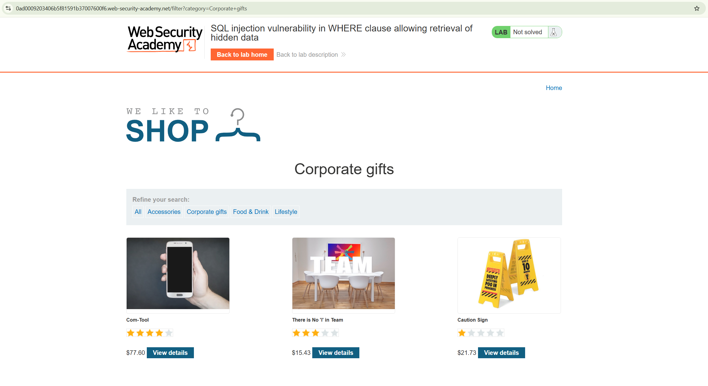

# Lab 001 — SQL injection

**Plateforme :** PortSwigger Web Security Academy

## Objectif

Afficher les produits masqués en contournant le filtre de catégorie.

## Étapes

1. Ouvrir une catégorie de produits.
2. Modifier le paramètre `category`.
3. Utiliser :

```text
' OR 1=1 --
```

## Résultat

Les produits d'autres catégories sont affichés et le lab est validé.


La page d'accueil affiche les produits et les catégories disponibles.



Après la sélection de **Corporate gifts**, seuls les produits de cette catégorie sont affichés.


La charge utile contourne le filtre : les produits d'autres catégories apparaissent et le lab est résolu.

> Lab PortSwigger réalisé dans un environnement autorisé.
