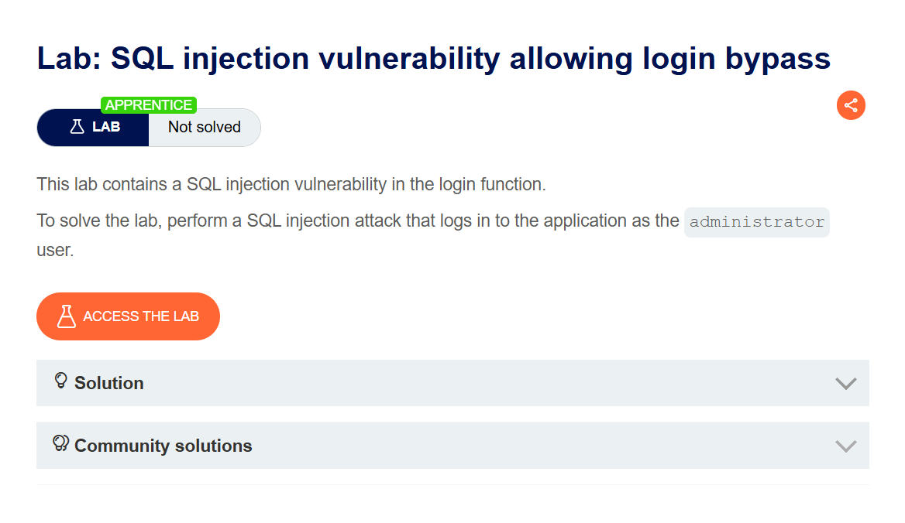
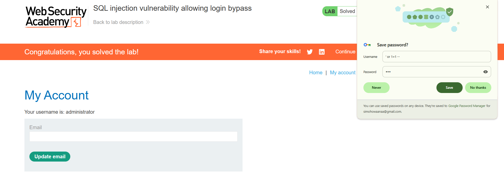

# Lab 002 — SQL injection login bypass

**Plateforme :** PortSwigger Web Security Academy

## Objectif

Se connecter avec le compte `administrator` en contournant le formulaire de connexion.

## Étapes

1. Ouvrir la page de connexion.
2. Tester le champ utilisateur avec :

```text
' OR 1=1 --
```

3. Envoyer le formulaire.

## Résultat

La connexion est contournée et l'accès au compte `administrator` est obtenu.



Le lab indique que la vulnérabilité est située dans le formulaire de connexion et que l'objectif est d'accéder au compte administrateur.


La boutique contient le lien **My account**, qui mène au formulaire de connexion ciblé.



Après l'injection, l'application affiche le compte `administrator` et le lab est validé.

> Lab PortSwigger réalisé dans un environnement autorisé.
