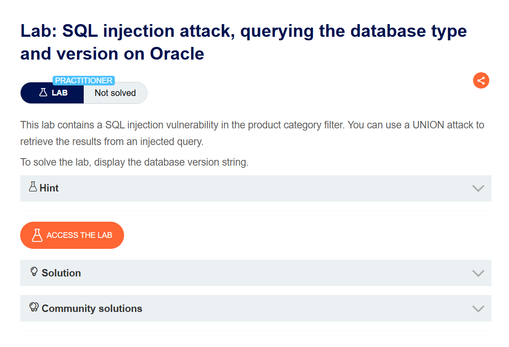
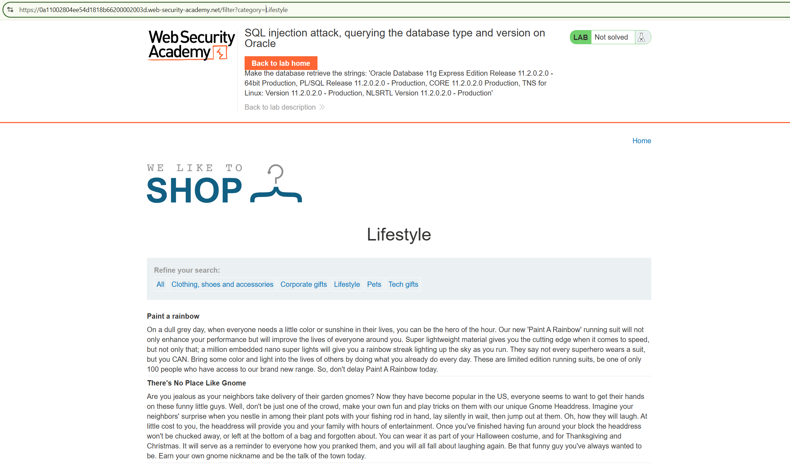
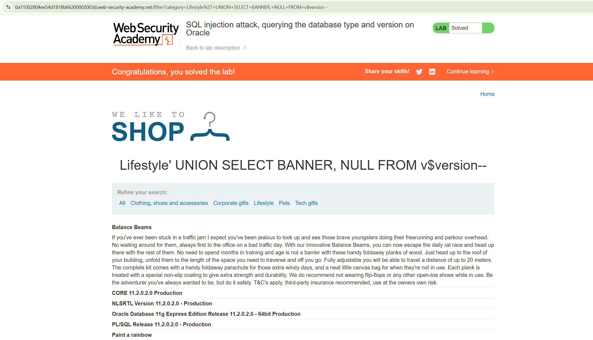

# Lab 003 — SQL injection Oracle database version

**Plateforme :** PortSwigger Web Security Academy

## Objectif

Afficher le type et la version de la base Oracle avec une injection SQL `UNION`.

## Étapes

1. Ouvrir une catégorie de produits.
2. Tester le paramètre `category`.
3. Utiliser :

```text
' UNION SELECT BANNER,NULL FROM v$version--
```

## Résultat

La réponse affiche les valeurs de version Oracle et le lab est validé.



Cette page indique que l'injection SQL se trouve dans le filtre de catégorie et que l'objectif est d'afficher la version de la base.



La catégorie **Lifestyle** est utilisée dans le paramètre `category`, qui devient le point d'entrée de l'injection.



La charge utile affiche les valeurs renvoyées par `v$version`, dont la version Oracle, puis le lab est résolu.

> Lab PortSwigger réalisé dans un environnement autorisé.
