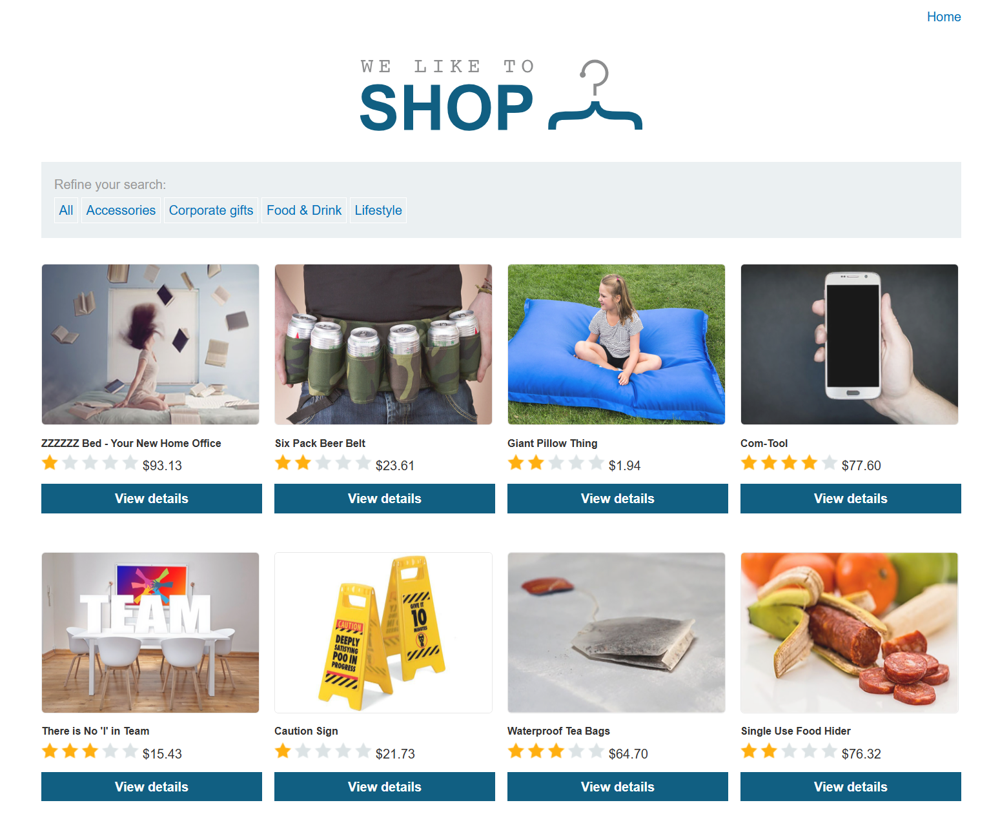

# PortSwigger Web Security Academy — SQL injection in WHERE clause allowing retrieval of hidden data

> **Statut :** Terminé
> **Difficulté :** Apprentice
> **Type :** Web / SQL injection
> **Plateforme :** PortSwigger Web Security Academy

## Autorisation et périmètre

Ce write-up concerne exclusivement un laboratoire PortSwigger Web Security Academy, conçu pour l'apprentissage. La technique décrite ne doit être appliquée à aucune cible réelle sans autorisation explicite.

## Résumé exécutif

L'application filtre le catalogue selon une catégorie, transmise dans un paramètre d'URL. En fermant la chaîne attendue puis en ajoutant une condition toujours vraie suivie d'un commentaire SQL, le filtre est contourné. Le serveur retourne alors des produits qui ne devraient pas apparaître dans la catégorie sélectionnée.

## Objectif

Identifier puis exploiter une injection SQL dans une clause `WHERE` afin d'afficher les données masquées du catalogue.

## Reconnaissance

La page d'accueil présente des catégories de produits. La sélection de **Corporate gifts** modifie le paramètre `category` dans l'URL et limite normalement les résultats.




## Exploitation

Le paramètre `category` est inséré dans une requête SQL côté serveur sans contrôle suffisant. Le test suivant ferme la valeur attendue, introduit une expression booléenne vraie et met en commentaire le reste de la requête :

```text
' OR 1=1 --
```

La réponse affiche des éléments issus d'autres catégories, ce qui confirme que le filtre SQL est contourné.


## Impact

Dans une application réelle, ce défaut peut permettre la lecture de données non prévues par la fonctionnalité, le contournement de filtres métier et, selon le contexte, l'exposition d'informations sensibles.

## Remédiation

- Utiliser des requêtes paramétrées / prepared statements pour toutes les entrées utilisateur.
- Valider les valeurs de catégorie avec une liste d'autorisations côté serveur.
- Appliquer le principe de moindre privilège au compte de base de données.
- Journaliser et surveiller les erreurs ou patterns de requêtes anormaux.

## Enseignements

- Un paramètre apparemment anodin peut atteindre directement une requête SQL.
- La variation de résultat après un test booléen est un indicateur utile pour valider une hypothèse d'injection.
- Les correctifs robustes reposent sur le paramétrage des requêtes, pas sur le filtrage de caractères.

## Référence

- [PortSwigger — SQL injection](https://portswigger.net/web-security/sql-injection)
